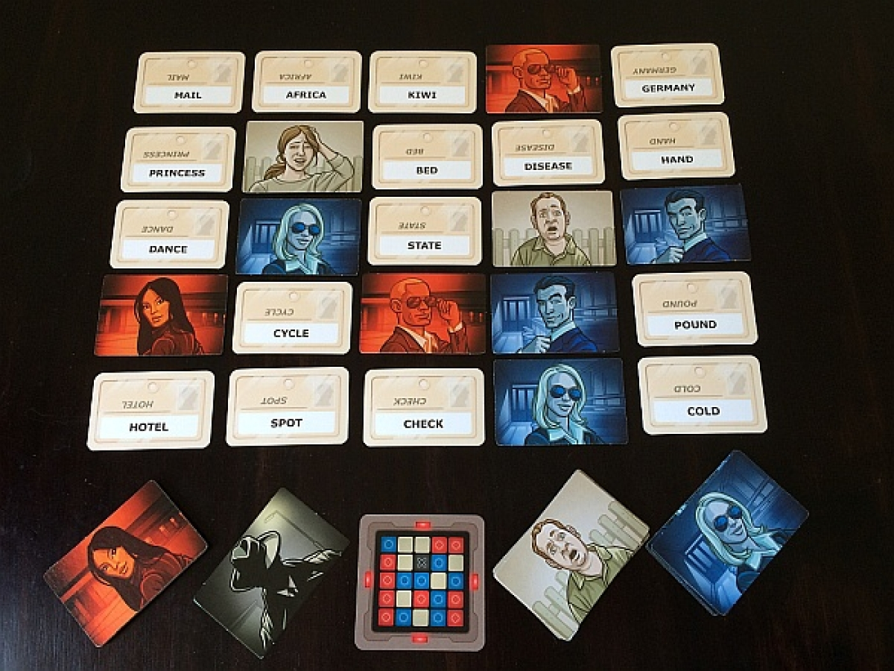

# CrypticMonikers

CrypicMonikers will be a digital version of the popular tabletop card game "Codenames."

Codenames features a large pool of cards with words and phrases printed on them, some of which are laid out in a 5x5 grid each game.
 One player from each team will have information about which cards belong to each team, and they have to give clues
 to get their team to guess which cards those are.

Ideally the game will have support for multiple simultaneous users across several devices, each updating in real time.
It would need two different display modes, one for the players who are guessing which words belong to each team, and one 
"decoded" display that shows all the answers.

In addition, the game will have a function that allows users to register, and then submit their own words to the pool 
(given some sort of validation),and another way to remove them.

###Things that need to happen:

* Create logins and allow people to submit words
* Create a tool for removing words from DB
* Create a dynamic game space with two different displays
* Allow the same game session to be displayed across multiple devices
* Have the session display update when the state of the board changes

